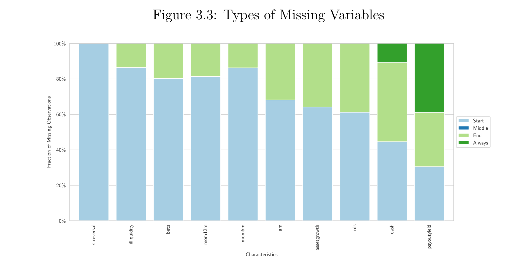

-------
## Abstract
This paper reports on the missingness of observations in data for more than 120 factors found in the finance literature. No stock has all factors observed at any point in time, a problem that is highlighted by the multidimensional nature of asset pricing data. Due to the complex nature of missing patterns and their importance for inference on anomalies, I perform a comparative analysis of imputation methods for missing data in the cross-section of char acteristics. Through an EM algorithm, I perform imputations for 120 signals. 

Imputations have a marginal effect when considering 120 signals alone, re sulting in a .5% drop in the average cumulative return of anomalies with a .1 drop in Sharpe ratio. However, performance disparity becomes economically significant when considering a larger set of signals. Average signal cumu lative return drops by more than 40% when considering 204 signals in the sample.

## Main findings
Paterns of missing observations in asset pricing data is persistent and complex, with a considerable proportion of observations missing from most datasets in the industry.

Notably, in most novel datasets in the current literature, missing observations consist of at least a third of total observations.

    <table>
        <thead>
            <tr>
                <th style="text-align: center;">Data Subsets</th>
                <th style="text-align: center;">Dataset 1</th>
                <th style="text-align: center;">Dataset 2</th>
                <th style="text-align: center;">Dataset 3</th>
            </tr>
        </thead>
        <tbody>
            <tr>
                <td style="text-align: center;">Missing %</td>
                <td style="text-align: center;">56.2%</td>
                <td style="text-align: center;">36.5%</td>
                <td style="text-align: center;">38.2%</td>
            </tr>
            <tr>
                <td style="text-align: center;">Coverage</td>
                <td style="text-align: center;">204</td>
                <td style="text-align: center;">120</td>
                <td style="text-align: center;">80</td>
            </tr>
            <tr>
                <td style="text-align: center;">Date Range</td>
                <td style="text-align: center;">1925-2023</td>
                <td style="text-align: center;">1986-2022</td>
                <td style="text-align: center;">1978-2021</td>
            </tr>
        </tbody>
    </table>

The data above consists of three datasets that contain fator data. A factor here refers to a characteristic or signal that is assumed to produce abnormal returns. All three datasets were built in somewhat a similar way. They scraped signals that were published in the literature, replicated the signals and constructed a large panel dataset with signals across time. As you observed in the table above, many of those signals have missing data.

In the current literature, missing observations are either dropped or replased with the mean of observations. This would be okay if data was missing at random.

However, when taking a close look at **how** data is missing, we can see that current methods are not achieving the desiered effect. For instance, take the table bellow:

  
  
   

  
  
  
  
  
  
  
  
  
  
  
  
  
  
  
  
  
  
  
  

  
  
  
  
  
  
  
  

  
  

